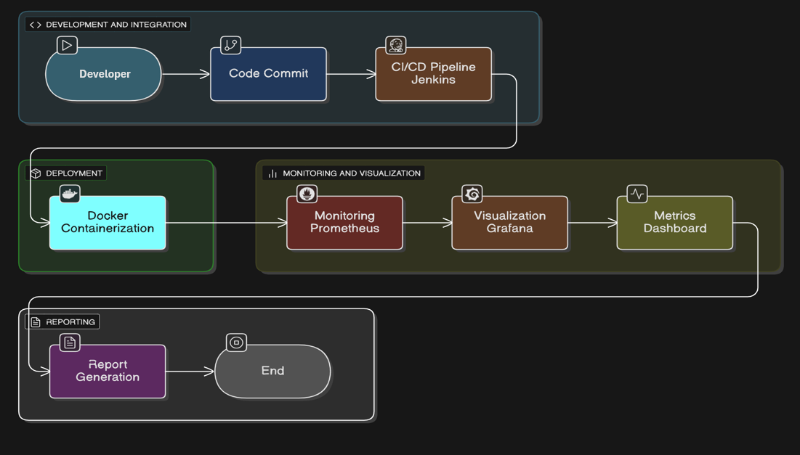

# 🛡️ DevSecOps Metrics Dashboard

---

## 📌 Project Overview

This project aims to provide a **centralized DevSecOps metrics dashboard** that consolidates performance, build, and security insights from multiple tools into a single view.  
It helps executives monitor **software delivery efficiency**, **security posture**, and **overall DevSecOps health** in real time.

Unlike traditional methods that analyze data separately from CI/CD and security scanners, this system integrates **Jenkins**, **Docker**, **Prometheus**, and **Grafana** to automate metric collection and visualization.

---

## 🎯 Objectives

- 🔗 Integrate DevOps and Security (**DevSecOps**) practices seamlessly  
- ⚙️ Automate data collection from Jenkins pipelines and monitoring tools  
- 📊 Provide a visual, real-time dashboard using Grafana and Prometheus  
- 💡 Empower teams with actionable insights on deployment and vulnerability trends  

---

## 🏗️ System Architecture

Here’s the overall workflow of the system:

1. **Code Commit:** Developers push code to GitHub  
2. **CI/CD Pipelines (Jenkins):** Two pipelines — *Python* and *Build-Metrics* — automate build, test, and deployment stages  
3. **Containerization (Docker):** Applications run inside Docker containers for consistency  
4. **Monitoring (Prometheus):** Collects and stores performance and build metrics  
5. **Visualization (Grafana):** Displays metrics on real-time dashboards for executive insights  

---

### 🧩 Architecture Diagram

